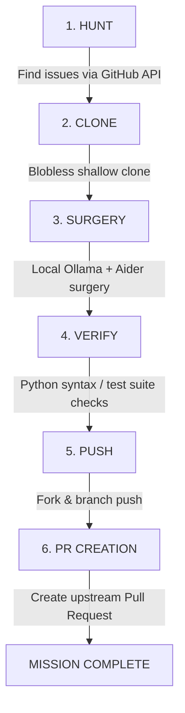

# 🎯 Surgical Bug Sniper (SBK)

Surgical Bug Sniper (SBK) is an autonomous, state-driven agentic pipeline designed to scan open-source repositories for actionable bugs, reproduce/verify them locally, perform precise code surgery using local LLMs (via Ollama) and Aider, and submit automated fixes back to GitHub via pull requests.

Optimized specifically for consumer GPUs (like an RTX 3050 with 6GB VRAM), SBK offloads high-level discovery tasks and integrates powerful local coding models to run entirely free of API token fees.

---

## 🛠️ Architecture & Pipeline Flow

SBK operates as a sequential pipeline with the following modules:



1. **The Scout (Hunt):** Scans a whitelist of repositories in parallel for open bug issues using GitHub API, prioritizing reports with error tracebacks, exceptions, code blocks, or precise filenames.
2. **The Laboratory (Clone):** Performs a blobless, shallow clone of the target repository to minimize disk/memory usage.
3. **The Surgeon (Surgery):** Employs **Qwen 2.5 Coder 7B** (via Ollama) and a smart sliding context window to generate search-and-replace patches matching the target codebase's exact syntax and styling.
4. **The Gatekeeper (Verify):** Performs compilation and syntax checks on modified files to verify no syntax errors were introduced.
5. **The Diplomat (Push & PR):** Automates the forks, branches, atomic commits, pushes, and opening of Pull Requests on GitHub.

---

## 💻 Streamlit UI Control Dashboard

The project includes a sleek, dark-themed Streamlit dashboard providing live visual feedback.

- **Real-Time Step Tracker:** Visually tracks the active step (Hunt -> Clone -> Surgery -> Verify -> Push).
- **Live Operation Feed:** Feeds raw logs from the backend execution continuously with auto-scrolling terminal logs.
- **Controls:** Easy **FIRE** launch trigger and **ABORT** kill switch to safely stop running sub-processes.

---

## 🚀 Setup & Installation

### 1. Prerequisites
- **Python 3.10+**
- **Git** installed and authenticated on your local machine.
- **Ollama** installed and running on your host machine.

### 2. Install Local Model
Ensure Ollama is running and download the coding model:
```bash
ollama pull qwen2.5-coder:7b
```

### 3. Setup Project Environment
Clone this repository and navigate to the project folder:
```bash
git clone https://github.com/your-username/surgical-bug-sniper.git
cd surgical-bug-sniper
```

Create a virtual environment and install requirements:
```bash
python -m venv .venv
source .venv/bin/activate  # On Windows use: .venv\Scripts\activate
pip install -r requirements.txt
```

### 4. Configure Environment Variables
Copy `.env.example` to `.env`:
```bash
cp .env.example .env
```
Edit the `.env` file to configure your settings, especially your **`GITHUB_TOKEN`**:
```ini
GITHUB_TOKEN=your_personal_access_token_here
AIDER_MODEL=ollama_chat/qwen2.5-coder:7b
OLLAMA_API_BASE=http://localhost:11434
```

---

## 🎯 Usage

### Streamlit Control Panel (Recommended)
Launch the interactive web UI:
```bash
streamlit run sbk_ui.py
```
Open your browser to the URL printed in your console (usually `http://localhost:8501`). Click **FIRE** to start hunting!

### CLI Mode
You can also run the pipeline directly from the command line:
```bash
python sbk.py
```

---

## 🔍 Whitelisted Target Repositories
By default, the Scout is configured to scan and target:
- `langchain-ai/langgraph`
- `joaomdmoura/crewAI`
- `run-llama/llama_index`
- `qdrant/qdrant`
- `ollama/ollama`
- `vllm-project/vllm`

You can modify the target repositories by editing the `WHITELIST` in `sbk.py`.
